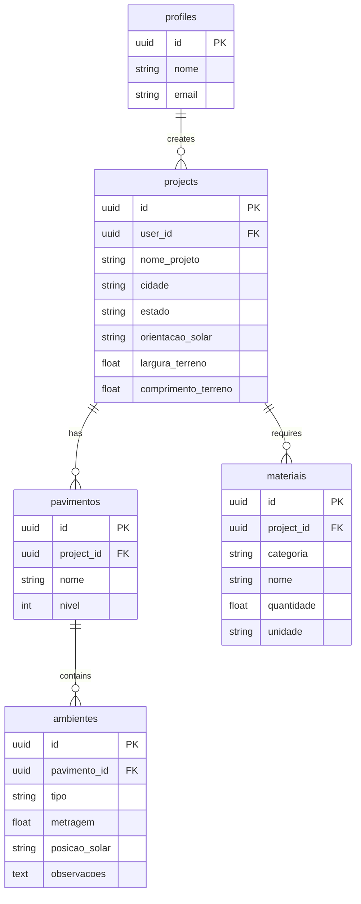

# ArchMaster Pro 🏛️

Plataforma profissional para criação, organização e documentação de projetos arquitetônicos residenciais de médio e alto padrão.

## 🚀 Visão Geral

O ArchMaster Pro permite que arquitetos gerenciem o ciclo de vida técnico de um projeto residencial, desde a análise de insolação inicial até a geração de relatórios de materiais e PDFs técnicos para clientes e fornecedores.

## 🛠️ Stack Utilizada

- **Frontend:** React 18, Vite, TypeScript, Tailwind CSS
- **Formulários:** React Hook Form, Zod
- **Backend/BaaS:** Supabase (Auth, PostgreSQL, RLS)
- **PDF:** jsPDF
- **Ícones:** Lucide React

## 📊 Modelagem de Dados (ER Diagram)



### Explicação do Diagrama
- **Profiles:** Armazena dados do arquiteto autenticado.
- **Projects:** Cabeçalho do projeto com dados de localização e terreno.
- **Pavimentos:** Estrutura de níveis da residência (Térreo, Superior, etc).
- **Ambientes:** Cômodos associados a um pavimento específico com dados de insolação local.
- **Materiais:** Itens quantificados para orçamentação e execução, categorizados (Elétrica, Hidráulica, etc).

## ⚙️ Configuração do Supabase

Para rodar este projeto, você deve criar as tabelas no Supabase:

1. **Profiles**
2. **Projects**
3. **Pavimentos**
4. **Ambientes**
5. **Materiais**

Ative o **RLS (Row Level Security)** em todas as tabelas e crie políticas para que `auth.uid() = user_id`.

## 💻 Como Rodar Localmente

1. Clone o repositório.
2. Instale as dependências: `npm install`.
3. Configure as variáveis de ambiente `.env`:
   ```env
   VITE_SUPABASE_URL=seu_url
   VITE_SUPABASE_ANON_KEY=seu_key
   ```
4. Inicie o servidor: `npm run dev`.

## 📦 Deploy na Vercel

1. Conecte seu repositório GitHub à Vercel.
2. Adicione as variáveis de ambiente acima nas configurações do projeto na Vercel.
3. Clique em Deploy.
